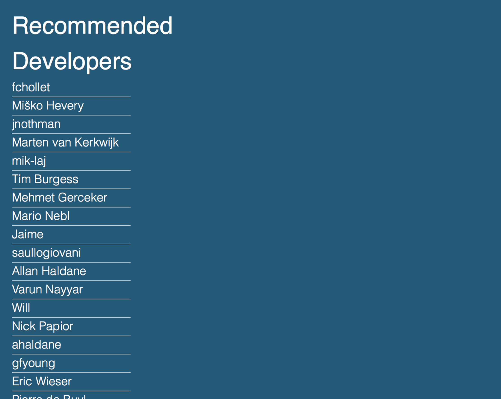
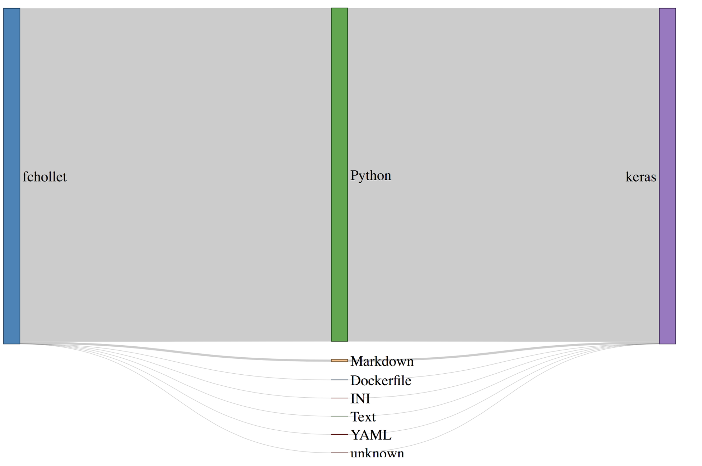

# Find my Geek
## What is Find my Geek?
A [proof of concept][1] recommendation system that aims to help companies optimize their current workforce to allocate their software developers to the most important projects.

To serve as a proof of concept, I gathered data of a little of under 300,000 software repositories for some of the most popular software repositories (based on stars), and their public commits from the past year. Then Find my Geek uses a hybrid matrix recommendation algorithm that takes into account the detailed repositories that the programmers have contributed to and the computer languages they have contributed in to make suggestions.

## How do you use Find my Geek?
The core functionality of Find my Geek is allowing users to select a repository to get suggestions:

Afterwards a list of recommended developers is presented:

To see why each developer is recommended, the user can click in each name and Find my Geek generates a visual profile of the activities of the programmer that summarizes the contributions of the programmers per language per repository:

## How does Find my Geek work?
Unlike a traditional, filter based, recommendation system that would make recommendations of developers just based in what repositories they have contributed in, Find my Geek uses the information contained in the public commits to make recommendations based on the “expertise” of the developers in different computer languages and the “technical needs” of each project.

From the commit information, Find my Geek calculates features per developer that serve as proxies of the “expertise” of each developer by counting the number of lines of code they added and deleted and the number of files added per computer language:

Similarly, for the “technical needs” of the repository, a proxy metric was developer based on the number of files per computer language:

Then Find my Geek uses a hybrid, matrix factorization method called [lightfm] that uses the developer and repository features as metadata to create latent vectors and make recommendations. It estimates a latent vector per each metadata feature and user (repository), which allows to perform any type of recommendation (user-user, item-user, item-item). Lightfm also has the added advantaged of being implemented in multithreaded (openMP) cython code, which made it a great option for a project that was developed in pretty much 2 weeks.

## How was Find my Geek implemented?

Find my Geek was implemented with a modular, layered, extendable architecture that allowed me to quickly prototype other recommendation algorithms. The architecture can be seen in the following image:

## Why did I build Find my Geek?
Besides my personal goal of learning and implementing a recommendation system for the first time, two other reasons drove me to implement Find my Geek:
- This system could be adapted to be used in internal repositories of companies or their activity in GitHub to  
	⁃ The visualizations and results could be reframed  to create advanced analytics of the relationship of the workforce and the projects.

## Summary and what's next
I designed Find my Geek as a prototype or proof of concept software developer recommendation system.       

[1]:	http://dantegd.com/insight
